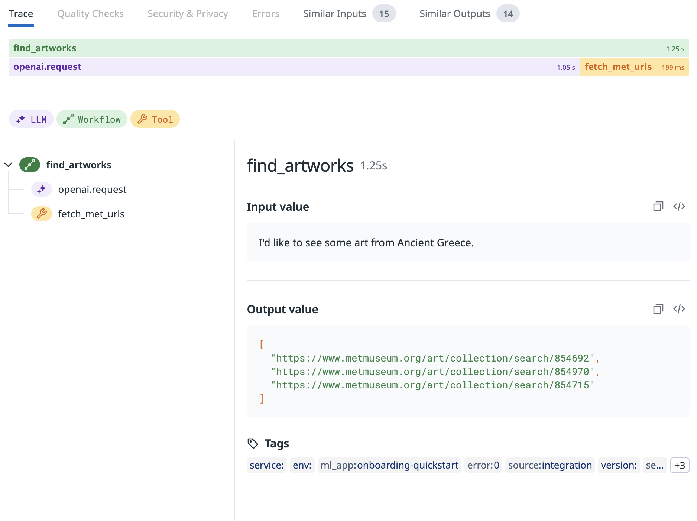
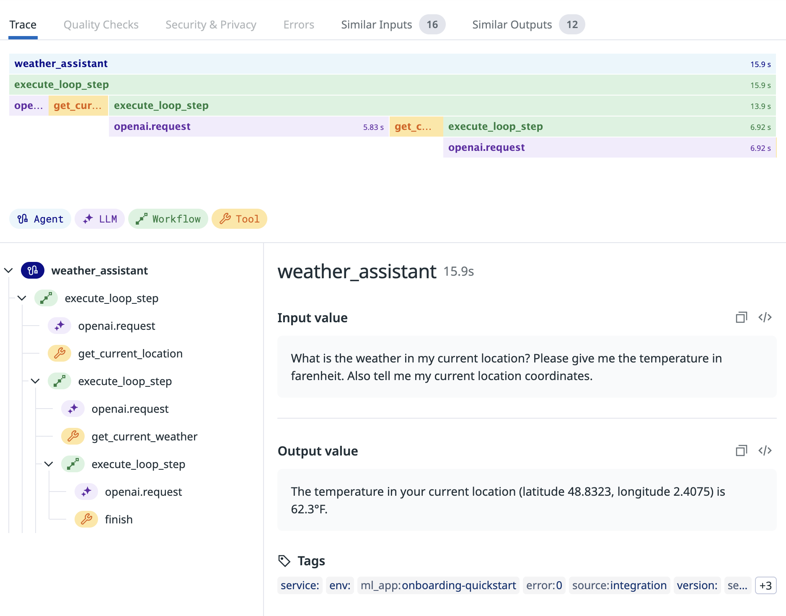
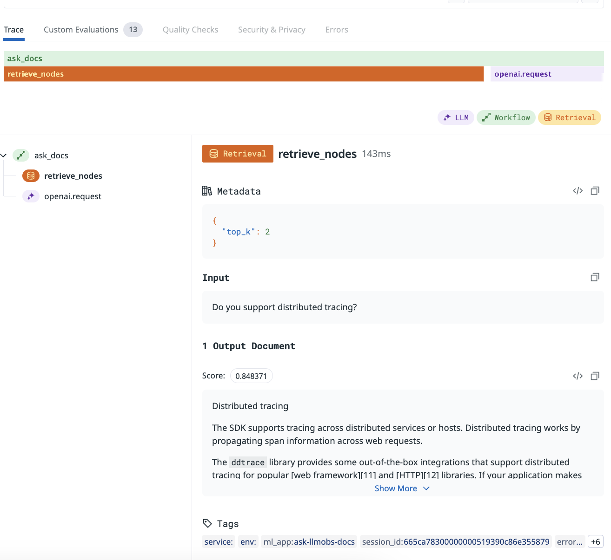

# LLM Observability Jupyter Notebooks

These notebooks introduce you to Datadog's [LLM Observability Python SDK](https://docs.datadoghq.com/llm_observability/setup/sdk/python/) using hands-on examples with Amazon Bedrock.

For a detailed instrumentation guide, see [Trace an LLM Application](https://docs.datadoghq.com/tracing/llm_observability/trace_an_llm_application/).

## Deployment Options

This project supports two deployment paths:

1. **Local Development**: Run the notebooks on your local machine
2. **AWS SageMaker**: Deploy and run in a managed AWS environment

For detailed deployment instructions, workshop guides, and production considerations, see the [deployment documentation](./deployment/README.md).

If you're interested in how we implemented the AWS SageMaker deployment option following Well-Architected best practices, check out our [implementation guide](./deployment/IMPLEMENTATION.md).

## Prerequisites

- [A Datadog API key](https://docs.datadoghq.com/account_management/api-app-keys)
- [AWS credentials configured for Amazon Bedrock access](https://docs.aws.amazon.com/bedrock/latest/userguide/setting-up.html)
- Access to Amazon Bedrock models (Claude models are used in the examples)

## Quick Setup (Local Development)

#### 1. Create and activate your virtual environment:

You can use either `uv` (recommended) or the standard `venv` module:

Using `uv`:
```bash
# Install uv if you don't have it already
pip install uv

# Create and activate virtual environment
uv venv
source .venv/bin/activate  # On Windows: .venv\Scripts\activate
```

Using standard venv:
```bash
python -m venv myenv
source myenv/bin/activate  # On Windows: myenv\Scripts\activate
```

#### 2. Create a .env file and add the following:

```bash
DD_API_KEY=<YOUR_DATADOG_API_KEY>
DD_SITE=<YOUR_DATADOG_SITE>
DD_LLMOBS_AGENTLESS_ENABLED=1
DD_LLMOBS_ML_APP="onboarding-quickstart"
```

- Note: if [your Datadog site](https://docs.datadoghq.com/getting_started/site/#access-the-datadog-site) (`DD_SITE`) is not provided, the value defaults to `"datadoghq.com"`
- Feel free to update the `DD_LLMOBS_ML_APP` variable to any custom app name.
- `DD_LLMOBS_AGENTLESS_ENABLED=1` is only required if the Datadog Agent is not running. If the agent is running in your production environment, make sure this environment variable is unset.


#### 3. If you don't already have AWS credentials configured, add them to the .env file:

```bash
AWS_ACCESS_KEY_ID=<YOUR_AWS_ACCESS_KEY_ID>
AWS_SECRET_ACCESS_KEY=<YOUR_AWS_SECRET_ACCESS_KEY>
AWS_REGION=<YOUR_AWS_REGION>
```

#### 4. Install shared dependencies from the requirements.txt file:

```bash
# Using uv (recommended)
uv pip install -r requirements.txt

# Or using standard pip
pip install -r requirements.txt
```

#### 5. Launch Jupyter notebooks

You can either start Jupyter on the command line (`jupyter notebook`) to use the web interface, or open your notebook from your preferred code editor (for example, VS Code) and run it there.

## Quick Setup (AWS SageMaker)

For a one-click deployment to SageMaker:

```bash
# Make the setup script executable
chmod +x deployment/setup.sh

# Run the setup script with SageMaker option
./deployment/setup.sh --sagemaker
```

This will:
1. Create a SageMaker notebook instance with appropriate IAM permissions
2. Configure Datadog environment variables
3. Clone this repository to the notebook instance
4. Install all required dependencies

Once deployed, access your notebook from the AWS SageMaker console.

## Notebooks

### 1. Tracing a simple LLM call

**[This notebook](./1-llm-span.ipynb)** shows you how to create and trace a simple LLM call.


### 2. Tracing an LLM Workflow

**[This notebook](./2-workflow-span.ipynb)** shows you how to create and trace a more complex, static series of steps that involves a tool call in addition to a call to an LLM.



### 3. Tracing an LLM Agent

**[This notebook](./3-agent-span.ipynb)** shows you how to create and trace an LLM powered agent that calls tools and makes decisions based on data about what to do next.



### 4. Tracing and evaluating a RAG workflow

**[This notebook](./4-custom-evaluations.ipynb)** shows you how to create, trace, and evaluate a RAG workflow.



## Teardown

When you're done with the tutorials, deactivate your virtualenv and return to your system's default Python env:

```bash
deactivate
```
